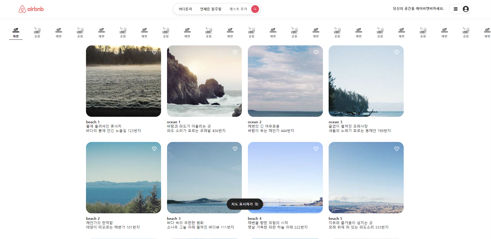

# project_cloneWeb

## 에어비앤비 클론 코딩 프로젝트

이 프로젝트는 에어비앤비의 웹페이지를 HTML, CSS, JavaScript를 이용하여 클론 코딩한 것입니다.

### 프로젝트 개요

에어비앤비는 전 세계적으로 인기 있는 숙박 예약 플랫폼 중 하나입니다. 이 프로젝트는 에어비앤비의 기본적인 웹페이지 디자인 및 기능을 재현하는 것을 목표로 합니다.

### 재현 내용

- 에어비앤비 헤더 부분 구현
- 상단 네비게이션 바 구현
- 숙박지 선택 영역 및 찜하기 표시 구현
- 지도 검색 바 구현

### 기술 스택

- HTML
- CSS
- JavaScript

### 실행 방법

1. 이 저장소를 클론합니다.

    ```bash
    git clone https://github.com/fkwmqpfl01/project_cloneWeb.git
    ```

2. 클론한 디렉토리로 이동합니다.

    ```bash
    cd airbnb-clone
    ```

3. `index.html` 파일을 웹 브라우저로 엽니다.

### 스크린샷
구현한 웹 페이지의 스크린샷입니다.


### 로그
v1. 간단한 웹 페이지 구현

### 수정 예정 내용
 1. javaScript를 적용해 네비게이션 바마다 숙소 선택 영역을 구현할 예정입니다. 
 2. button을 통해 각 숙소마다 예약 정보를 선택할 수 있도록 보완할 예정입니다.

### 코드 관리자
fkwmqpfl01